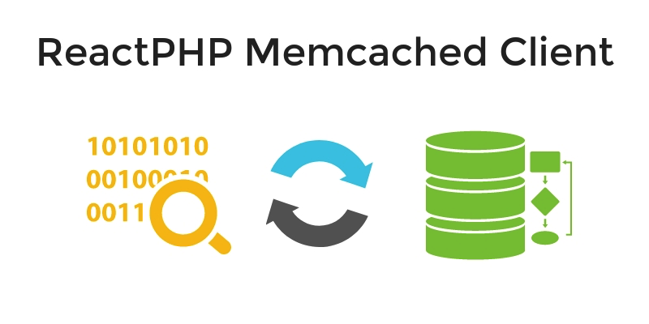

<p align="center">
    
</p>

Asynchronous Memcached PHP Client for [ReactPHP](http://reactphp.org/) ecosystem.

[](https://travis-ci.org/seregazhuk/php-react-memcached)

**Table of Contents**
- [Installation](#installation)
- [Quick Start](#quick-start)
- [Connection](#connection)
- [Client](#client)
- [Retrieval Commands](#retrieval-commands)
    - [Get](#get)
- [Storage Commands](#storage-commands)
    - [Set](#set)
    - [Add](#add)
    - [Replace](#replace)
- [Delete Command](#delete-command)
- [Increment/Decrement Commands](#increment/decrement-commands)
    - [Increment](#increment)
    - [Decrement](#decrement)
- [Touch Command](#touch-command)
- [Statistics Command](#statistics-command)
- [Misc Commands](#misc-commands)
    - [Flush all](#flush-all)
    - [Version](#version)
    - [Verbosity](#verbosity)       
 - [Connection Closing](#connection-closing)
    - [End](#end())
    - [Close](#close())
 - [Errors Handling](#errors-handling)

## Installation

### Dependencies
Library requires PHP 5.6.0 or above.

The recommended way to install this library is via [Composer](https://getcomposer.org). 
[New to Composer?](https://getcomposer.org/doc/00-intro.md)

See also the [CHANGELOG](CHANGELOG.md) for details about version upgrades.

```
composer require seregazhuk/react-memcached
```

## Quick Start

```php
$loop = React\EventLoop\Factory::create();
$factory = new Factory($loop);

$factory
    ->createClient('localhost:11211')
    ->then(function (Client $client) {
        $client->set('example', 'Hello world');

        $client->get('example')->then(function ($data) {
            echo $data . PHP_EOL; // Hello world
        });

        // Close the connection when all requests are resolved
        $client->end();
});

$loop->run();
```
See [other examples](https://github.com/seregazhuk/php-memcached-react/tree/master/examples).

## Connection

You can connect to server and create a client via the factory. It requires an instance of the `EventLoopInterface`:

```php
$loop = React\EventLoop\Factory::create();
$factory = new Factory($loop);
```

Then to create a client call `createClient()` method and pass a connection string:
```php
$factory->createClient('localhost:11211'')->then(
    function (Client $client) {
        // client connected
    },
    function (Exception $e) {
        // an error occurred while trying to connect 
    }
);
```

This method returns a promise. If connection was established the promise resolves with an instance of the `Client`. If 
something went wrong and connection wasn't established the promise will be rejected.

## Asynchronous Execution

For each memcached command a client has a method. All commands are executed asynchronously. The client stored pending 
requests and once it receives the response from the server, it starts resolving these requests. That means that each 
command returns a promise. When the server executed a command and returns a response, the promise will be resolved 
with this response. If there was an error, the promise will be rejected. 

## Retrieval Commands

### Get
Get value from key:

```php
$client
    ->get('some-key')
    ->then(function ($data) {
        echo "Retreived value: " . $data . PHP_EOL; 
    });
```

## Storage Commands
For `$flags` you can use PHP `MEMCACHE_COMPRESSED` constant to specify on-the-fly compression.
If the value was not stored indicate because condition for `add` or `replace` commands wasn’t met, or the item was in 
a delete queue, the promise will be rejected with `FailedCommandException`.

### Set
Store key/value pair in Memcached:

```php
$client
    ->set('some-key', 'my-data')
    ->then(function () {
        echo "Value was stored" . PHP_EOL;
    });
    
// advanced: with compression and expires in 30 seconds
$client
    ->set('some-key', 'my-data', MEMCACHE_COMPRESSED, 30)
    ->then(function () {
        echo "Value was stored" . PHP_EOL;
    });    
```

### Add
Store key/value pair in Memcached, but only if the server **doesn’t** already hold data for this key:

```php
$client
    ->add('name', 'test')
    ->then(function() {
        echo "The value was added" . PHP_EOL;
    });
    
    
// advanced: with compression and expires in 30 seconds
$client
    ->add('name', 'test', MEMCACHE_COMPRESSED, 30)
    ->then(function() {
        echo "The value was added" . PHP_EOL;
    });    
```

### Replace

Store key/value pair in Memcached, but only if the server already hold data for this key:
```php
$client
    ->replace('name', 'test')
    ->then(function(){
        echo "The value was replaced" . PHP_EOL;
    });
 
// advanced    
$client
    ->replace('name', 'test', $flags, $exptime)
    ->then(function(){
        echo "The value was replaced" . PHP_EOL;
    });    
```

## Delete Command
Delete value by key from Memcached.
If the key doesn't exist or has been deleted the promise rejects with `FailedCommandException`:

```php
$client
    ->delete('name')
    ->then(function(){
        echo "The value was deleted" . PHP_EOL;
});
```

## Increment/Decrement Commands

### Increment
Increment value associated with key in Memcached, item **must** exist, increment command will not create it.
The limit of increment is the 64 bit mark. If key is not found, the promise will be rejected with `FailedCommandException`:

```php
$client
    ->incr('var', 2)
    ->then(
        function($data){
            echo "New value is: " . $data . PHP_EOL;
        }, 
        function(FailedCommandException $e) {
            echo "Key not found" . PHP_EOL;
        });
```


### Decrement
Decrement value associated with key in Memcached, item **must** exist, decrement command will not create it
If you try to decrement a value bellow 0, value will stay at 0. If key is not found, the promise 
will be rejected with `FailedCommandException`:

```php
$client
    ->decr('var', 2)
    ->then(
        function($data){
            echo "New value is: " . $data . PHP_EOL;
        },
        function(FailedCommandException $e) {
            echo "Key not found" . PHP_EOL;
        });
```

If value not found, the promise will be rejected with `FailedCommandException`.

## Touch Command
The *touch* command is used to update the expiration time of an existing item without fetching it. If the key doesn't 
 exist or has been deleted the promise rejects with `FailedCommandException`:

```php
$client
    ->touch('var', $exp)
    ->then(
    function($data){
        echo "The value was toched". PHP_EOL;
    },
    function(FailedCommandException $e) {
        echo "Key not found" . PHP_EOL;
    });
```

## Statistics Command
This command can return an array of various stats:

```php
$client
    ->stats()
    ->then(function($result){
        print_r($result);
        /*
        Array
        (
            [pid] => 666
            [uptime] => 180660
            [time] => 1508342532
            ... 
            [lru_bumps_dropped] => 0
        )
        */
    });
```

## Misc Commands
### Flush all
Flush the server key/value pairs (invalidating them) after an optional [<time>] period:

```php
$client
    ->flushAll()
    ->then(function() {
        echo "Everything was flushed" . PHP_EOL;
    });
```

### Version
Return the Memcached server version:

```php
$client
    ->version()
    ->then(function($result) {
        echo "Memcached version: $result" . PHP_EOL; // Memcached version: 1.5.0
     });
```

### Verbosity
Change the verbosity output of Memcached server:

```php
$client
    ->verbosity(2)
    ->then(function($result) {
        echo "Verbosity was changed to 2" . PHP_EOL;
    });
```


## Connection Closing

### End()
To close the connection call `end()` method on the client. The client waits till all pending requests are resolved and
then closes the connection. All new requests to the client will be rejected with `ConnectionClosedException` exception.

### Close()
If you want to force the closing and don't want to wait for pending requests to be resolved, call `close()` method. It 
immediately closes the connection and rejects all pending requests with `ConnectionClosedException` exception.

## Errors Handling
All exceptions that are thrown by the client or are used to reject the promises extend from the
base `seregazhuk\React\Memcached\Exception\Exception` class.

For example, if you call an unknown Memcached command the promise will be rejected with `WrongCommandException`:

```php
$client
    ->unknown()
    ->then('var_dump', function(WrongCommandException $e){
        echo $e->getMessage() . PHP_EOL; // Unknown command: unknown
});
``` 
